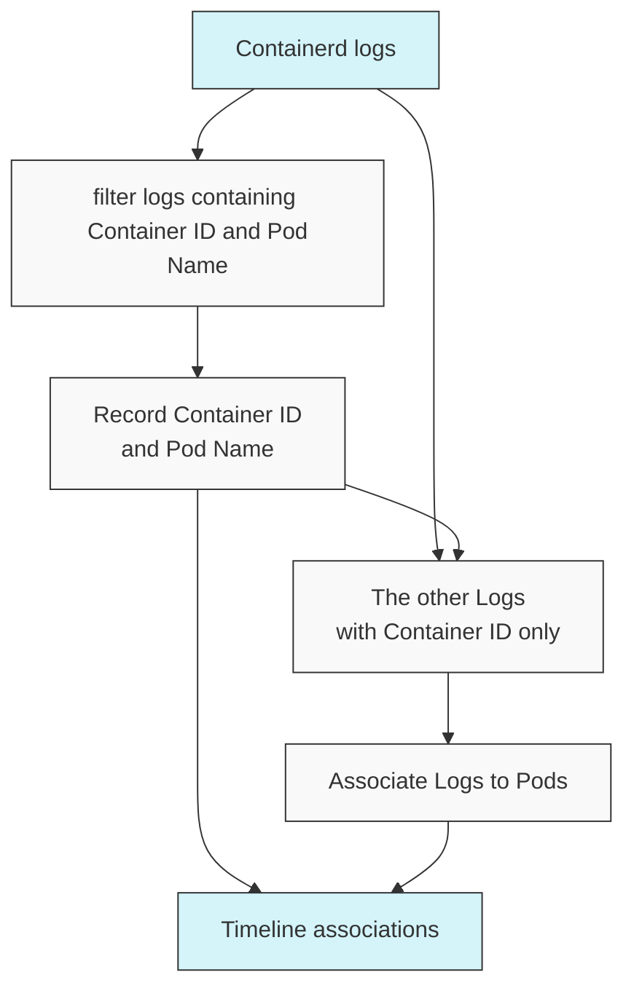
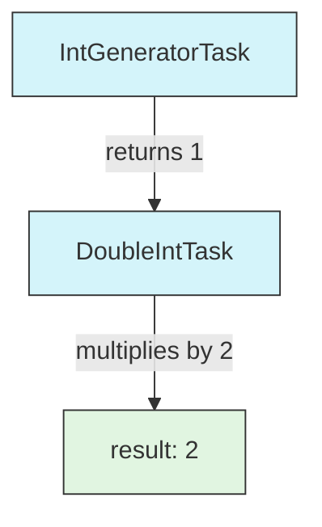
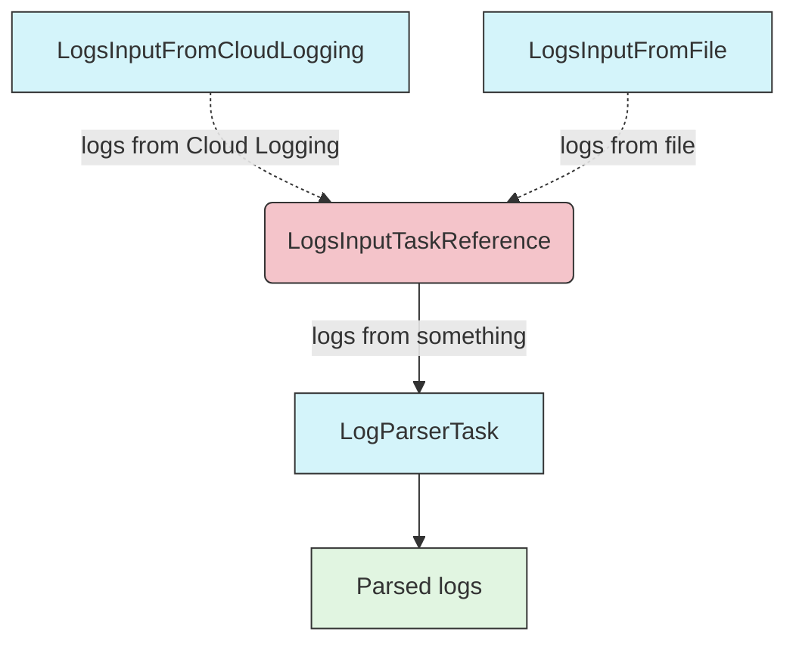
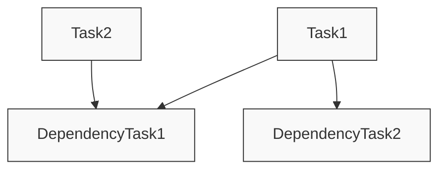
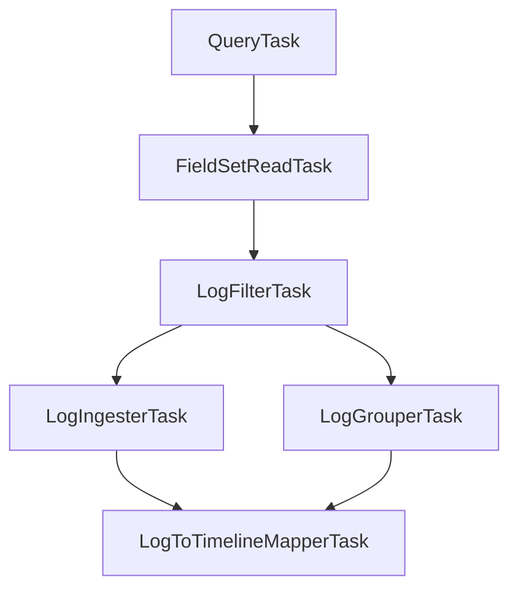

# KHI Task システムの概念

## ログ可視化システムの複雑性

KHI の拡張方法について議論する前に、ログ可視化システムに本質的に存在する複雑性について説明しましょう。
KHI は大量のログを入力として受け取り、各ログをタイムライン上の 1 つ以上の「イベント」や「リビジョン」と関連付けます。
一見すると、ログを入力として受け取り、タイムライン上の位置の配列を出力する単純な関数のように見えるかもしれません。

しかし実際には、他のログを調べなければ関連付けができないログが存在します。

- PATCH リクエストから生成されたリソースの「リビジョン」は、それ以前のリクエストを解析してリソースの状態を復元しなければ、その時点では再構築できません。
- Containerd ログに含まれるコンテナ ID は、Pod サンドボックス作成時に一度だけ出力される Pod 名と関連付けるログを調べなければ、特定の Pod にリンクできません。
- 様々なログに現れる IP は、タイミングによって異なるリソースに関連付けられる可能性があり、リソース名と IP の関連付けを確認するログを解析しなければ、IP しか含まないログをリソースにリンクすることはできません。

大量のログを有意味な形でリソースにリンクすることは、ログをグループに分け、決められた順序で解析し、リソースにリンクするという綿密な操作を必要とします。
これらの複雑な依存関係を効率的に処理するために、KHI は「ユーザー入力用の入力フィールド生成」「ログクエリ生成」「ログ収集」「各種パーサーの実行」を含む独自の DAG (Directed Acyclic Graph: 有向非巡回グラフ) で記述されたシステムを実装しています。



> 例: containerd ログを解析して Pod 名に関連付ける DAG のサブグラフ

KHI の拡張方法を学ぶには、この DAG システムを理解する必要があります。

## DAG で使用される基本的な形式

DAG (Directed Acyclic Graph: 有向非巡回グラフ) は、サイクルを持たずに一方向に流れるグラフです。KHI の文脈では、これはタスクが依存関係に基づいて特定の順序で実行されるワークフローを表します。グラフ内の各ノードはタスクであり、エッジはタスク間の依存関係を表します。

### タスクの型

KHI で使用される DAG タスクシステムでは、各タスクは `task.Task[T]` インターフェースを実装するように作成されます。
(詳細な実装については `pkg/core/task/task.go` を参照してください。)

このインターフェースは、概略として以下のような型として定義されています:
(実際には、TaskResult 型を気にする必要がない要素は `UntypedTask` インターフェースで実装されており、任意の `task.Task[T]` を一様に扱うために少し複雑な型定義がありますが、一般的理解には以下のフィールドで十分です。)

```go
type Task[TaskResult any] interface {
    // ID returns the unique identifier of the task.
    ID() taskid.TaskImplementationID[TaskResult]

    // Labels returns the labels associated with the task. KHI uses this value for various purposes (e.g. document generation, filtering tasks by cluster types, ...etc)
    Labels() *typedmap.ReadonlyTypedMap

    // Dependencies returns the IDs of tasks that need to be done before this task.
    Dependencies() []taskid.UntypedTaskReference

    // Run is the actual function called to run this task.
    Run(ctx context.Context) (TaskResult, error)
}
```

通常、このインターフェースを直接実装する必要はありません。`task.NewTask` 関数を使用してタスクを作成できます。
例として、固定の整数値を生成する `IntGeneratorTask` と、前のタスクからの値を 2 倍にする `DoubleIntTask` があるとします。

```go
var IntGeneratorTaskID = taskid.NewDefaultImplementationID[int]("example.khi.google.com/int-generator")
var DoubleIntTaskID = taskid.NewDefaultImplementationID[int]("example.khi.google.com/double-int")

var IntGeneratorTask = task.NewTask(IntGeneratorTaskID,[]taskid.UntypedTaskReference{}, func(ctx context.Context) (int, error){
    return 1, nil
})

var DoubleIntTask = task.NewTask(DoubleIntTaskID,[]taskid.UntypedTaskReference{IntGeneratorTaskID.Ref()}, func(ctx context.Context, reference taskid.TaskReference[int]) (int, error){
    intGeneratorResult := task.GetTaskResult(ctx, IntGeneratorTaskID.Ref())
    return intGeneratorResult * 2, nil
})
```



#### タスク ID とタスク参照

KHI では、各タスクは `taskid.TaskImplementationID[T]` 型の一意の ID を持ちます。
通常、これは `taskid.NewDefaultImplementationID[T](id string)` を呼び出して生成されます。

型パラメータは、この ID を使用するタスクが返す型です。`taskid.TaskImplementationID[T]` 型はタスクを定義する人が作成する必要がありますが、
そのタスクを参照する人は `taskid.TaskReference[T]` を使用する必要があります。

これはタスクの依存関係リストを指定するため、また依存する前のタスクから値を取得する `GetTaskResult[T](ctx context.Context, reference taskid.TaskReference[T])` でも使用されます。

多くの場合、`TaskReference[T]` は `Ref()` を通じて `TaskImplementationID[T]` から取得されます。
しかし、KHI のタスクシステムには、ID 自体に入力を抽象化するメカニズムがあります。
例えば、「Cloud Logging から収集されたログ」または「ファイルからアップロードされたログ」を「特定のパーサー」で処理するタスクグラフを作成したいとします。

```go
var LogsInputTaskReference = taskid.NewTaskReference[[]Log]("example.khi.google.com/log-input")
var LogsInputFromCloudLoggingTaskID = taskid.NewImplementationID(LogsInputTaskReference, "cloud-logging")
var LogsInputFromFileTaskID = taskid.NewImplementationID(LogsInputTaskReference, "file")

var LogParserTaskID = taskid.NewDefaultImplementationID[[]ParsedLog]("example.khi.google.com/log-parser")

var LogsInputFromCloudLoggingTask = task.NewTask(LogsInputFromCloudLoggingTaskID, []taskid.UntypedTaskReference{}, func(ctx context.Context) ([]Log, error) {
 // Get logs from Cloud Logging
 return logs, nil
})

var LogsInputFromFileTask = task.NewTask(LogsInputFromFileTaskID, []taskid.UntypedTaskReference{}, func(ctx context.Context) ([]Log, error) {
 // Get logs from file
 return logs, nil
})

var LogParserTask = task.NewTask(LogParserTaskID, []taskid.UntypedTaskReference{LogsInputTaskReference}, func(ctx context.Context) ([]ParsedLog, error) {
 logs := task.GetTaskResult(ctx, LogsInputTaskReference)
 // Parse logs
 return parsedLogs, nil
})
```



TaskReference はタスクの特定の具体的な実装を指定しないため、タスクグラフに含まれるタスクを並べ替えるだけで、DAG グラフの一部を再利用できます。

### タスク内部からの値の取得

#### 前のタスクからの結果の取得

依存するタスクが出力する値は、タスクに渡されたコンテキストと TaskReference を使用して `task.GetTaskResult` 関数で取得できます。
コンテキストは、タスク関数自体に渡された正確なコンテキスト値である必要があります。

```go
taskResult := coretask.GetTaskResult(ctx, SomeTaskID.Ref())
// The taskResult type is T when SomeTaskID is taskid.TaskImplementationID[T]
```

#### タスクグラフ外部からの値の取得

KHI では、値はコンテキストに含めることでタスクグラフに渡されます。
また、コンテキストで提供される値を型安全に扱うために、`khictx` パッケージで定義された関数を使用します。

```go
contextValueID := typedmap.NewTypedKey[string]("a-string-value") // This is a key associating string value.
theValue := typedmap.GetOrDefault(ctx, contextValueID, "default-value")
```

### タスク内でのログ出力

KHI はログ出力に `log/slog` パッケージを使用します。KHI のログハンドラは、タスクコンテキストから情報を抽出することで自動的にログをタスク名に関連付け、各ログエントリを生成したタスクを明確にします。このため、タスク内でログを出力する場合は、コンテキスト非対応のものよりも、`slog.InfoContext`、`slog.WarnContext`、`slog.ErrorContext` などのコンテキスト対応のログメソッドを常に使用する必要があります。

例:

```go
task.NewTask(TaskID, []taskid.UntypedTaskReference{}, func(ctx context.Context) (Result, error) {
    // Good: Using context-aware logging
    slog.InfoContext(ctx, "Processing started")

    // Bad: Using non context-aware logging
    // slog.Info("Processing started")
    // fmt.Printf("Processing started")

    // ... task implementation ...
    return result, nil
})
```

### タスクのパッケージ構造

タスクは多くの場合、パッケージレベルのグローバル変数として定義されます。しかし、同じパッケージ内のグローバル変数の初期化順序は Go 言語によって保証されていません。[参照: The Go Programming Language Specification](https://go.dev/ref/spec#Package_initialization) これにより、タスクがまだ `nil` である別の `TaskID` への参照で初期化されるエラーが発生する可能性があります。

この問題を確実に解決するために、タスクの **"contract"** (タスク ID とそれらが使用する型を含む) と **"implementation"** を別々のパッケージに分離します。実装パッケージはコントラクトパッケージをインポートするため、Go は実装の前にコントラクト (およびその `TaskID`) が完全に初期化されることを保証します。

以下の標準構造を使用します。例えば、`foo` という機能の場合:

```plaintext
pkg/task/inspection/foo/
├── contract/
│   └── taskid.go          // package foocontract
├── impl/
│   └── parsertask.go   // package fooimpl
└── registration.go     // package foo
```

各コンポーネントの役割

- `contract/` (package foocontract)

  TaskID 変数を含み、TaskID の型パラメータとして使用される結果型を定義します。コントラクトパッケージには、タスクラベルキーやその型パラメータで使用される型も含まれる場合があります。
  コントラクトパッケージは実装パッケージに依存してはいけません。

- `impl/` (package fooimpl)

  このパッケージには、タスクの実際の実装ロジックが含まれます。
  TaskID を安全に参照するためにコントラクトパッケージをインポートします。

- `registration.go` (package foo)

  通常、(fooimpl パッケージからの) タスクインスタンスを中央タスクレジストリに登録する関数が含まれます。この関数は、上位層のパッケージまたは `cmd/kubernetes-history-inspector/` 内のファイルの初期化ステップから呼び出されます。

### タスクのテスト

タスクをテストするには、以下の 2 つのヘルパー関数のいずれかを使用します:

- `tasktest.RunTask`: 特定のタスクを呼び出し、結果の値とエラーを受け取るために使用します
- `tasktest.RunTaskWithDependency`: 指定されたタスクリストで依存関係を解決し、特定のタスクを実行して、結果の値とエラーを受け取るために使用します

#### tasktest.RunTask

特定の入力でタスクを実行し、その結果をテストしたいだけの場合は、`tasktest.RunTask` を使用してください。

```go

var ReturnSomeNumberReference = taskid.NewTaskReference[int]("example.khi.google.com/some-number")
var DoubleNumberTaskID = taskid.NewDefaultImplementationID[int]("example.khi.google.com/double-number")

var DoubleNumberTask = task.NewTask(DoubleNumberTaskID, []taskid.UntypedTaskReference{}, func(ctx context.Context) (int, error) {
    number := task.GetTaskResult(ctx, ReturnSomeNumberReference)
 return number * 2, nil
})

func TestRunTask(t *testing.T) {
 result,err := tasktest.RunTask(context.Background(), DoubleNumberTaskID, tasktest.NewTaskDependencyValuePair(ReturnSomeNumberReference, 5))
 if err != nil {
  t.Fatalf("failed to run task: %v", err)
 }
 if result != 10 {
  t.Fatalf("unexpected result: %v", result)
 }
}
```

#### tasktest.RunTaskWithDependency

場合によっては、タスクの入力となるテストケースを作成するのが難しく、実際に依存タスクも実行したいことがあります。

```go
var SimpleInputTaskReference = taskid.NewTaskReference[int]("example.khi.google.com/simple-input")
var ComplexOutputTaskID = taskid.NewDefaultImplementationID[ComplexOutput]("example.khi.google.com/complex-output")
var TestingTargetTaskID = taskid.NewDefaultImplementationID[int]("example.khi.google.com/testing-target")

var ComplexOutputTask = task.NewTask(ComplexOutputTaskID, []taskid.UntypedTaskReference{SimpleInputTaskReference}, func(ctx context.Context) ([]int, error) {
 input := task.GetTaskResult(ctx, SimpleInputTaskReference)
    // Do the complex processing
 return complex,nil
})

var TestingTargetTask = task.NewTask(TestingTargetTaskID, []taskid.UntypedTaskReference{ComplexOutputTaskID.Ref()}, func(ctx context.Context) (int, error) {
 complexOutput := task.GetTaskResult(ctx, ComplexOutputTaskID.Ref())
    // Consume the complex output and produce a comperable output
    return testOutput, nil
})

func TestRunTaskWithDependency(t *testing.T) {
 result, err := tasktest.RunTaskWithDependency(context.Background(), TestingTargetTaskID,[]coretask.UntypedTask{ComplexOutputTask,tasktest.StubTaskFromReferenceID(SimpleInputTaskReference, 5, nil)})
 if err != nil {
  t.Fatalf("failed to run task: %v", err)
 }
 if result != EXPECTED_VALUE {
  t.Fatalf("unexpected result: %v", result)
 }
}
```

上記の例では、`SimpleInputTaskReference` として固定値 5 を返すテストタスクを作成し、このスタブタスクを依存関係として渡しています。

`RunTaskWithDependency` を使用すると、`task_test.StubTaskFromReferenceID` によって生成されたスタブタスクが実行され、次に ComplexOutputTask が実際に実行され、最後に TestingTargetTask が実行されて実行結果を取得・比較します。

## タスクグラフの解決と実行

### タスクグラフの依存関係と順序の解決

KHI を拡張する場合、通常はタスクグラフの実行について気にする必要はありません。しかし、KHI がどのようにタスクグラフを実行するかを理解しておくと、後の説明がわかりやすくなります。
KHI では、複数のタスクがグループ化され、`TaskSet` 型として一緒に実行されます。

```go
taskSet := task.NewTaskSet([]task.UntypedTask{
    Task1,
    Task2,
    Task3
})
```

通常、`TaskSet` は直接実行できません。トポロジカルソートで処理し、必要な依存タスクを追加して、実行可能なグラフを構築する必要があります。

```go
dependencyTaskSet := task.NewTaskSet([]task.UntypedTask{
    DependencyTask1,
    DependencyTask2,
    DependencyTask3
})
taskSet := task.NewTaskSet([]task.UntypedTask{
    Task1,
    Task2
})

resolvedTaskSet, err := taskSet.ResolveTask(dependencyTaskSet)
```

`TaskSet` 型の `ResolveTask` メソッドは、含まれているタスクを実行可能な順序にソートします。これらのタスクに不足している依存関係がある場合、引数として渡された別の `TaskSet` から必要なタスクのみを含めます。タスクに循環参照がある場合、または提供された `TaskSet` が必要な依存関係を満たしていない場合、`ResolveTask` はエラーを返します。

これらのタスクが以下のような依存関係を持っていると仮定しましょう:



この場合、`DependencyTask1` と `DependencyTask2` の間には依存関係がないため、これらは最初に実行され、並行して実行できます。`DependencyTask1` が完了すると `Task2` が実行され、`DependencyTask2` が完了すると `Task1` が実行されるようなグラフ構造が形成されます。
`DependencyTask3` は `Task1` または `Task2` のいずれからも参照されていないため、`resolvedTaskSet` には含まれません。

### タスクグラフの実行

依存関係と実行順序が解決された `TaskSet` は、`TaskRunner` インターフェースを実装する型によって実行できます。
現在、`LocalRunner` のみが実装されているため、解決された `TaskSet` を以下のように実行できます:

```go
taskRunner := task.NewLocalRunner(resolvedTaskSet)

err := taskRunner.Run(context.Background())

<- taskRunner.Wait()

result, err := taskRunner.Result()
```

上記のように、タスクを実行し、完了を待ち、結果を取得できます。
結果は各タスクの出力を含む `typedmap` として返されますが、特定のタスクの結果が必要な場合は、`task.GetTaskResultFromLocalRunner` を使用します。

```go
taskRunner := task.NewLocalRunner(resolvedTaskSet)

err := taskRunner.Run(context.Background())

<- taskRunner.Wait()

_, err := taskRunner.Result() // make sure the task graph ended without error

result := task.GetTaskResultFromLocalRunner(taskRunner, TaskID)
```

## インスペクションタスク

ここまでに説明したタスクメカニズムは、KHI のログ分析目的のみに依存するものではありません。
しかし、KHI は、KHI 専用にこのシステム上に実装されたログ処理タスクグラフメカニズムを通じて拡張性を維持しながら、さまざまな種類のログを分析します。

### KHI における UI フローとタスクグラフの関係

KHI を使用する場合、ユーザーは以下のようなワークフローに従います:


実際のログ処理に使用される様々なタスクは、KHI の初期化中に `InspectionServer` に登録されます。
ユーザーが `New Inspection` ボタンをクリックすると、まず `Inspection Type` を選択する必要があります。すると KHI は、登録されたタスクをフィルタリングし、選択された `Inspection Type` で動作可能なタスクのみを含めます。これには、ユーザーが有効化または無効化できるタスクだけでなく、それらの依存関係で使用されるすべてのタスクも含まれます。
次に、ユーザーはログの種類を選択します。これは KHI 内部では Feature タスクと呼ばれる特別なタスクのリストとして表現されます。KHI は Feature タスクであり、かつ選択された Inspection Type で利用可能なタスクのみを表示し、ユーザーが各タスクを含めるかどうかを選択できるようにします。

ユーザーによって選択されたタスクを実行するために、KHI はまず、Inspection Type によってフィルタリングされた利用可能なタスク全体の部分タスク集合を使用して依存関係を解決し、トポロジカルソートを実行してタスクグラフを構築します。
ログ分析のためのタスクグラフを実行する際、KHI はコンテキストを通じて `Metadata` と呼ばれる JSON シリアライズ可能な値を渡します。この `Metadata` は、タスク実行中の任意の時点で実行外部からアクセスできます。
例えば、タスクが時間のかかる処理を実行している場合、この `Metadata` に格納されている Progress メタデータを編集できます。フロントエンドがタスクリストを取得すると、この `Metadata` が読み取られ、進捗状況がフロントエンドに表示されます。
フォーム編集についても同様です。フォーム編集中に Dryrun モードで実行される各タスクは、フロントエンドがフォームを表示するために必要な情報を `Metadata` に埋め込みます。フロントエンドはこの情報を取得して実際のフロントエンドをレンダリングします。

### インスペクションタスクサーバーへのタスク登録

KHI のビルドスクリプトは自動で初期化時に`task/inspection/<パッケージ名>/impl`以下に`registration.go`が存在する場合に`Register()`を呼び出すよう構成します。
新しいタスクを追加するパッケージを定義するには、この`Register()`関数の中で、タスクや Inspection Type を登録する必要があります。

example:

```go
// Register registers all googlecloudlogserialport inspection tasks to the registry.
func Register(registry coreinspection.InspectionTaskRegistry) error {
 err := registry.AddInspectionType(ossclusterk8s_contract.OSSKubernetesLogFilesInspectionType)
 if err != nil {
  return err
 }

 return coretask.RegisterTasks(registry,
  InputAuditLogFilesTask,
  AuditLogFileReaderTask,
  EventAuditLogFilterTask,
  NonEventAuditLogFilterTask,
  OSSK8sEventLogParserTask,
  OSSK8sAuditLogFieldExtractorTask,
  OSSK8sAuditLogParserTailTask,
 )
}
```

### インスペクションタスクのラベル

先ほどタスクについて議論した際、ラベルについては深く触れませんでしたが、KHI の各タスクはラベルのマップを持っています。
KHI はこの機能を利用して、KHI に登録されているすべてのタスクのセットから特定のタスクセットを選択します。

#### InspectionType ラベル

タスクに適用される InspectionType ラベルは []string 型の値を持ちます。これらは InspectionType ID の配列であり、ユーザーが UI で Inspection Type を選択した際に、以下の基準に基づいてタスクが依存関係の候補として含まれるかどうかを決定します:

- タスクが InspectionType ラベルを持っていない (任意の InspectionType で使用できるタスクとして解釈される)
- タスクが InspectionType ラベルの 1 つとしてユーザーが選択した InspectionType の ID を含んでいる

例えば、これらのラベルを持つタスクを以下のように定義できます:

```go
var IntGeneratorTaskID = taskid.NewDefaultImplementationID[int]("example.khi.google.com/int-generator")

var IntGeneratorTask = task.NewTask(IntGeneratorTaskID, []taskid.UntypedTaskReference{}, func(ctx context.Context) (int, error) {
 return 1, nil
}, inspectioncore_contract.InspectionTypeLabel("gcp-gke","gcp-gdcv-for-baremetal")) // This task is only available when user selected GKE or GDCV for Baremetal on the inspection type selection

var DoubleIntTaskID = taskid.NewDefaultImplementationID[int]("example.khi.google.com/double-int")

var DoubleIntTask = task.NewTask(DoubleIntTaskID, []taskid.UntypedTaskReference{IntGeneratorTaskID.Ref()}, func(ctx context.Context, reference taskid.TaskReference[int]) (int, error) {
 intGeneratorResult := task.GetTaskResult(ctx, IntGeneratorTaskID.Ref())
 return intGeneratorResult * 2, nil
}) // This task is available for any inspection type

```

#### FeatureTask ラベル

KHI では、ユーザーが有効化または無効化できるタスクを Feature タスクと呼びます。これらも単なる通常のタスクですが、特定のラベルが付与されています。
Feature タスクは UI でユーザーによって選択される必要があるため、タイトルや説明などの追加ラベルが付与されます。これらは `task.FeatureTaskLabel` 関数を使用して一度に割り当てることができます。

```go

var ContainerdLogFeatureTaskID = taskid.NewDefaultImplementationID[[]Log]("example.khi.google.com/containerd-log-feature")

var ContainerdLogFeatureTask = task.NewTask(ContainerdLogFeatureTaskID, []taskid.UntypedTaskReference{}, func(ctx context.Context) ([]Log, error) {
 // Get logs from containerd
 return logs, nil
}, inspectioncore_contract.FeatureTaskLabel("title","description",/*Log type*/,/*is default feature or not */, "gcp-gke","gcp-gdcv-for-baremetal"))

```

新しいパーサーを実装する場合、この `FeatureTaskLabel` 関数によって生成されたラベルを持つタスクを登録することがよくあります。
FeatureTaskLabel では、最後に必須の可変長引数として InspectionType を指定する必要があることに注意してください。

### タスクモード

KHI はインスペクション用のタスクを `run` または `dryrun` モードで実行します。グラフが構築されると、KHI はユーザーがフォーム値を編集中に定期的にタスクグラフを `dryrun` モードで実行します。`run` モードでのみ実行されるタスクは、`dryrun` モードの場合に処理をスキップするために、コンテキスト値からこのタスクモードを読み取る必要があります。

```go
taskMode := khictx.MustGetValue(ctx, inspectioncore_contract.InspectionTaskMode)
// taskMode should be inspectioncore_contract.TaskModeDryRun or inspectioncore_contract.TaskModeRun
```

ユーザーは通常、`task.NewTask` のラッパーである `inspection_task.NewInspectionTask()` を使用する場合、コンテキストからタスクモードを取得する必要はありません。

```go
var Task = inspection_task.NewInspectionTask(TestTaskID, []taskid.UntypedTaskReference{}, func(ctx context.Context, taskMode inspection_task_interface.TaskMode) (Result, error) {
 if taskMode == inspection_task_interface.TaskModeDryRun { // Skip the task processing when the mode is dryrun.
  return nil, nil
 }
 // ...
})
```

### タスクメタデータ

KHI の各タスクは、タスクの結果だけでなく、さまざまな追加情報を出力できます。
例えば、ログ収集に使用されたクエリや、タスクによって出力されたログなどが含まれる場合があります。

KHI では、タスクの主な出力ではないデータは Metadata と呼ばれる単一のマップで管理されます。タスクグラフが実行されると、最初に空のマップが渡され、各タスクが必要に応じて値を追加します。
Metadata はタスクの実行中でも読み取ることができます。これは重要です。なぜなら、例えばプログレスバーの値はタスクによって継続的に書き込まれ、実行中でもタスクメタデータとして取得できる必要があるからです。

メタデータマップを取得するには、以下のように `khictx` を使用してコンテキストから取得できます:

```go
metadata := khictx.MustGetValue(ctx, inspectioncore_contract.InspectionRunMetadata)
```

通常の拡張を行う開発者は、メタデータの存在を意識する必要はありません。通常、これらはさまざまなユーティリティによってラップされており、値は自動的に設定されます。

#### 入力フィールド

Metadata の主要な用途の 1 つは、ログフィルタを作成する際のフォームです。
各タスクはフォームに必要なメタデータをフォームメタデータに書き込み、フロントエンドはそれを受け取ってフォームをレンダリングします。

ただし、ユーザーがメタデータの扱いの詳細を理解する必要はありません。例えば、テキストフォームの場合は `formtask.NewTextFormTaskBuilder` を使用します。

以下は、Duration 値を入力するためのフォームタスクの実践的な例です。フォームもタスクであるため、前提タスクを持つことができます。

```go
var InputDurationTask = formtask.NewTextFormTaskBuilder(InputDurationTaskID, PriorityForQueryTimeGroup+4000, "Duration").
 WithDependencies([]taskid.UntypedTaskReference{
  InspectionTimeTaskID,
  InputEndTimeTaskID,
  TimeZoneShiftInputTaskID,
 }).
 WithDescription("The duration of time range to gather logs. Supported time units are `h`,`m` or `s`. (Example: `3h30m`)").
 WithDefaultValueFunc(func(ctx context.Context, previousValues []string) (string, error) {
  if len(previousValues) > 0 {
   return previousValues[0], nil
  } else {
   return "1h", nil
  }
 }).
 WithHintFunc(func(ctx context.Context, value string, convertedValue any) (string, form_metadata.ParameterHintType, error) {
  inspectionTime := task.GetTaskResult(ctx, InspectionTimeTaskID.Ref())
  endTime := task.GetTaskResult(ctx, InputEndTimeTaskID.Ref())
  timezoneShift := task.GetTaskResult(ctx, TimeZoneShiftInputTaskID.Ref())

  duration := convertedValue.(time.Duration)
  startTime := endTime.Add(-duration)
  startToNow := inspectionTime.Sub(startTime)
  hintString := ""
  if startToNow > time.Hour*24*30 {
   hintString += "Specified time range starts from over than 30 days ago, maybe some logs are missing and the generated result could be incomplete.\n"
  }
  if duration > time.Hour*3 {
   hintString += "This duration can be too long for big clusters and lead OOM. Please retry with shorter duration when your machine crashed.\n"
  }
  hintString += fmt.Sprintf("Query range:\n%s\n", toTimeDurationWithTimezone(startTime, endTime, timezoneShift, true))
  hintString += fmt.Sprintf("(UTC: %s)\n", toTimeDurationWithTimezone(startTime, endTime, time.UTC, false))
  hintString += fmt.Sprintf("(PDT: %s)", toTimeDurationWithTimezone(startTime, endTime, time.FixedZone("PDT", -7*3600), false))
  return hintString, form_metadata.Info, nil
 }).
 WithSuggestionsConstant([]string{"1m", "10m", "1h", "3h", "12h", "24h"}).
 WithValidator(func(ctx context.Context, value string) (string, error) {
  d, err := time.ParseDuration(value)
  if err != nil {
   return err.Error(), nil
  }
  if d <= 0 {
   return "duration must be positive", nil
  }
  return "", nil
 }).
 WithConverter(func(ctx context.Context, value string) (time.Duration, error) {
  d, err := time.ParseDuration(value)
  if err != nil {
   return 0, err
  }
  return d, nil
 }).
 Build()
```

これらのフォームフィールド設定はフォームメタデータに格納されます。

```go
metadata := khictx.MustGetValue(ctx, inspection_task_contextkey.InspectionRunMetadata)
formFields, found := typedmap.Get(metadata, form_metadata.FormFieldSetMetadataKey)
```

## ログを解析するためのタスクユーティリティ

KHI はその堅牢なタスクシステムを使用してログ解析を実行します。このアーキテクチャは KHI を非常に拡張性の高いものにし（新しいタスクを作成するだけで新しい機能を追加できます）、Go の並行処理機能をフル活用することを可能にします。しかし、ログ解析には多くの共通パターンがあるため、ログ解析タスクは KHI が提供する高レベルなタスク作成ユーティリティを使用して実装すべきです。

KHI は、基本的なログ解析のユースケースをカバーするために、以下の高レベルタスク作成ユーティリティを提供しています:

- FieldSetReadTask : 構造化ログのフィールドを型付き構造体に格納します。
- LogGrouperTask : 特定のフィールドでログをグループ化します。
- LogFilterTask : 条件に基づいてログをフィルタリングします。
- LogIngesterTask : ログを最終的な履歴データに取り込みます。
- LogToTimelineMapperTask : 取り込まれたログをタイムラインにマッピングします。

これらのタスクは通常、以下の図のように接続されます:



KHI はログをリソースに関連付ける前に、まずログを取り込む必要があることに注意してください。

### FieldSetReadTask

解析における一般的かつ重要なステップは、単一のログエントリから特定のフィールドを読み取ることです。この操作は通常他のログから独立しているため、並行して実行できます。モノリシックなパーサーにフィールドを順次読み取らせるのではなく、KHI は `FieldSetReadTask` を使用してそれらを同時に処理します。このタスクは各ログから事前定義されたフィールドを並行して読み取り、強く型付けされた結果 (FieldSet と呼ばれます) を対応するログオブジェクトに付加します。

例えば、特定のデータを抽出するために `FieldSet` 型とその対応するリーダーを定義できます:

```go
// Define a struct for the data you want to extract.
type PodInfoFieldSet struct {
    PodName      string
    ContainerID  string
}
func (fs *PodInfoFieldSet) Kind() string { return "PodInfo" }

// Create a reader that implements the log.FieldSetReader interface.
type PodInfoReader struct{}
func (r *PodInfoReader) FieldSetKind() string { return "PodInfo" }
func (r *PodInfoReader) Read(reader *structured.NodeReader) (log.FieldSet, error) {
    // Logic to read from the log's structured data.
    return &PodInfoFieldSet{
        PodName:      reader.ReadStringOrDefault("podName", ""),
        ContainerID:  reader.ReadStringOrDefault("containerID", ""),
    }, nil
}

// In your task graph, create a FieldSetReadTask.
var ReadPodInfoTask = inspectiontaskbase.NewFieldSetReadTask(
    ReadPodInfoTaskID,
    SourceLogsTaskID.Ref(), // Depends on a task that returns []*log.Log, likely from a Query.
    []log.FieldSetReader{&PodInfoReader{}},
)
```

グラフ内の後続のタスクは、各ログオブジェクトから解析済みの `PodInfoFieldSet` にアクセスできるようになり、高価な解析ステップが一度だけ並行して行われることが保証されます。

後続のタスクでは以下の様にしてログのインスタンスから FieldSet 構造体を読み取れます。

```go
func FieldSetConsumer(l *log.Log){
  p := log.MustGetFieldSet(l, &PodInfoFieldSet{})
}
```

単一のフィールドセットに対して複数のフィールドセットリーダーを定義できます。フィールドセットはリーダーによる実際のフィールドへのアクセス方法を抽象化しますが、実際のリーダーはクラスタータイプに応じて FieldSetReadTask として注入できます。例えば、OSS kube-apiserver 監査ログと GKE kubernetes 監査ログは同じフィールドセットに依存しますが、一部のフィールド名が GKE で独自であるため、リーダーは異なります。

### NewLogGrouperTask

ログ解析はしばしば時系列に従う必要がありますが、異なるリソース (例: 2 つの異なる Pod) に対する操作は通常独立しており、並行して処理できます。これを可能にするために、リソース名や ID などの特定のフィールドに基づいてログをグループ化する `NewLogGrouperTask` が使用されます。

```go
// This task takes a list of logs and a grouper function.
var GroupLogsByPodTask = inspectiontaskbase.NewLogGrouperTask(
    GroupLogsByPodTaskID,
    SourceLogsTaskID.Ref(), // Depends on the source logs
    func(ctx context.Context, l *log.Log) string {
        // Group by Pod name. Assumes FieldSetReadTask has already run.
        if podInfo, ok := log.GetFieldSet(l, &PodInfoFieldSet{}); ok {
            return podInfo.PodName
        }
  return "unknown-pod"
    },
)
```

これにより、下流のタスクは各 Pod のログを並行して処理できるため、パフォーマンスが大幅に向上します。

### NewLogFilterTask

多くの場合、パーサーはログのサブセットに対してのみ操作を行う必要があります。`NewLogFilterTask` は、述語関数に基づいてログリストをフィルタリングする簡単な方法を提供します。これは、以降のより高価な処理タスクの範囲を絞り込むのに役立ちます。

```go
// This task takes a list of logs and a filter function.
var FilterPodLogsTask = inspectiontaskbase.NewLogFilterTask(
    FilterPodLogsTaskID,
    SourceLogsTaskID.Ref(), // Depends on the source logs
    func(ctx context.Context, l *log.Log) bool {
        // Keep only logs related to Pods. Assumes FieldSetReadTask has run.
        if podInfo, ok := log.GetFieldSet(l, &PodInfoFieldSet{}); ok {
            return podInfo.PodName != ""
        }
        return false
    },
)
```

### NewLogIngesterTask

`LogIngesterTask` は、ログから抽出された他のデータを追加する前に、ログを KHI ファイルに取り込む責任があります。

> [!IMPORTANT] > `LogIngesterTask` によって処理されたログのみが最終的な KHI ファイルに書き込まれます。クエリされたログの一部を最終結果から除外したい場合は、`LogIngesterTask` に渡す前に**必ず**フィルタリングする必要があります。この目的には `NewLogFilterTask` を使用してください。
>
> ログにリンクされた結果データを生成するタスク (例: `LogToTimelineMapperTask`) は、`LogIngesterTask` によって処理されていないログの情報を保存できません。ターゲットのログが最初に取り込まれていることを確認してください。

```go
var IngestLogsTask = inspectiontaskbase.NewLogIngesterTask(
    IngestLogsTaskID,
    SourceLogsTaskID.Ref(), // taskid.TaskReference[[]log.Log]
)
```

### NewLogToTimelineMapperTask

`LogToTimelineMapperTask` はログを複数のリソースに関連付けたり、ログサマリーを上書きしたりします。

履歴を変更するには、`ProcessLogByGroup` に渡される `ChangeSet` オブジェクトを使用します。

#### `ChangeSet` の操作

- **`AddEvent(resourcePath)`**: タイムラインに特定の時点のイベントを追加します。
- **`AddRevision(resourcePath, revision)`**: 特定の時間における状態を追加します。
- **`AddResourceAlias(source, dest)`**: リソースをリンクします (例: Pod -> Owner)。
- **`SetLogSummary(summary)` / `SetLogSeverity(severity)`**: ログメタデータを上書きします。

### リソースとのログ関連付けのマッピング

これはリソースごとにログをグループ化した後にログを処理し、`ProcessLogByGroup` の `prevGroupData` 引数を使用して、同じグループ内のログ間で状態を維持することを可能にします。

```go
// Define a custom struct to hold state between logs in the same group.
type MyGroupData struct {
    Count int
}

type MyMapper struct {}

// Implement LogToTimelineMapper interface
func (m *MyMapper) ProcessLogByGroup(ctx context.Context, l *log.Log, cs *history.ChangeSet, builder *history.Builder, prevData MyGroupData) (MyGroupData, error) {
    // Modify history via ChangeSet
    cs.SetLogSeverity(enum.SeverityInfo)

    // Add an event to a resource timeline
    cs.AddEvent(resourcepath.NameLayerGeneralItem("v1", "Pod", "default", "my-pod"))

    // Pass updated state to the next log in the group
    return MyGroupData{Count: prevData.Count + 1}, nil
}

// ... Implement other interface methods (Dependencies, LogIngesterTask, GroupedLogTask) ...

var MyMapperTask = inspectiontaskbase.NewLogToTimelineMapperTask(
    MyMapperTaskID,
    &MyMapper{},
    inspectioncore_contract.FeatureTaskLabel("my-mapper",/*rest of the other parameters*/)  // LogToTimelineMapper is usually labeled with FeatureTaskLabel.
)
```

#### ChangeSet 結果のテスト

シンプルなユニットテストで `testchangeset.ChangeSetAsserter` を使用してマッパーロジックをテストすべきです。これにより、`ChangeSet` の変更を宣言的に検証できます。

```go
func TestMyMapper_ProcessLogByGroup(t *testing.T) {
    // 1. Setup Inputs
    l := log.NewLogWithFieldSetsForTest(&log.CommonFieldSet{Timestamp: time.Now()}, /* ... */)
    cs := history.NewChangeSet(l)
    mapper := &MyMapper{}

    // 2. Run Logic
    _, err := mapper.ProcessLogByGroup(t.Context(), l, cs, nil, MyGroupData{})
    if err != nil {
        t.Fatalf("unexpected error: %v", err)
    }

    // 3. Verify using ChangeSetAsserter
    asserters := []testchangeset.ChangeSetAsserter{
        &testchangeset.HasEvent{
            ResourcePath: "v1#Pod#default#my-pod",
        },
        &testchangeset.HasLogSeverity{
            WantLogSummary: "expected summary",
        },
    }

    for _, a := range asserters {
        a.Assert(t, cs)
    }
}
```

## ログから情報を発見するためのタスクユーティリティ

ログパーサーは、ログをリソースに関連付けるために、(`時刻 T に "x.y.z.w" を取得したのは誰か`、`コンテナ ID "6123c..." に関連付けられている Pod はどれか` など) の情報を必要とすることがよくあります。この情報は複数のログソースから得られる可能性がありますが、ユーザーは KHI でどのログを処理するかを切り替えることができます。

KHI は、複数のソースから情報を収集するための `Discovery-Inventory` パターンタスクユーティリティを提供します。

### Inventory Task

`InventoryTask` フレームワークは、複数のオプションのログソースからの情報を単一の統合されたビューに集約する問題を解決します。これにより、データ消費者（最終的なマッピング、例えば ContainerID から Pod へのマッピングが必要なだけの人）とデータプロバイダー（特定のログパーサー）が分離されます。

#### 使用法

1. **Builder を定義する**: 統合されたインベントリ用の一意の ID を持つ `InventoryTaskBuilder` を作成します。
2. **Discovery Task を作成する**: ビルダーの `DiscoveryTask` メソッドを使用して、さまざまなソースから部分的なインベントリデータを抽出するタスクを作成します。
3. **Inventory Task を作成する**: ビルダーの `InventoryTask` メソッドを使用して、マージ戦略を使用してすべての発見結果を集約する最終タスクを作成します。

#### 例: コンテナ ID インベントリ

```go
// 1. Define the Builder
var ContainerIDInventoryBuilder = inspectiontaskbase.NewInventoryTaskBuilder[ContainerIDToContainerIdentity](ContainerIDInventoryTaskID)

// 2. Define Discovery Tasks (e.g., from Audit Logs)
// This task discovers container ID to container identity mappings from manifests.
// Discovery tasks must depend on a task labeled with `FeatureTaskLabel`. This ensures the discovery task is activated only when the corresponding feature is selected by the user.
var ContainerIDDiscoveryTask = ContainerIDInventoryBuilder.DiscoveryTask(
    ContainerIDDiscoveryTaskID,
    []taskid.UntypedTaskReference{ManifestGeneratorTaskID.Ref()},
    func(ctx context.Context, taskMode inspectioncore.InspectionTaskModeType, progress *inspectionmetadata.TaskProgressMetadata) (ContainerIDToContainerIdentity, error) {
        if taskMode != inspectioncore.InspectionTaskModeRun {
            return nil, nil
        }
        // ... extract container IDs and their identities from manifests ...
        // For example:
        manifests := coretask.GetTaskResult(ctx, ManifestGeneratorTaskID.Ref())
        partialResult := make(ContainerIDToContainerIdentity)
        for _, manifest := range manifests {
            if containerID, identity := extractContainerInfo(manifest); containerID != "" {
                partialResult[containerID] = identity
            }
        }
        return partialResult, nil
    },
)

// 3. Define the Inventory Task with a Merger Strategy
// The merger strategy defines how to combine results from multiple discovery tasks.
type ContainerIDMergeStrategy struct{}

// Merge combines two ContainerIDToContainerIdentity maps.
func (s *ContainerIDMergeStrategy) Merge(identities []ContainerIDToContainerIdentity) ContainerIDToContainerIdentity {
    // logic to merge given identities from DiscoveryTask into a single identity instance
}

var ContainerIDInventoryTask = ContainerIDInventoryBuilder.InventoryTask(&ContainerIDMergeStrategy{})
```

## 低レベルタスクユーティリティ

高レベルのタスクユーティリティではニーズを満たせない場合、ベースからタスクを定義するためのいくつかの低レベルユーティリティがあります。

### NewProgressReportableInspectionTask

タスクが短時間で完了する場合でも、低レベルのタスクを定義する際は `NewProgressReportableInspectionTask` を使用すべきです。
これは `progress` 引数を提供し、タスクがユーザーにステータスを報告できるようにします。

```go
var HeavyProcessingTask = inspectiontaskbase.NewProgressReportableInspectionTask(
    HeavyProcessingTaskID,
    []taskid.UntypedTaskReference{SourceLogsTaskID.Ref()},
    func(ctx context.Context, taskMode inspectioncore_contract.InspectionTaskModeType, progress *inspectionmetadata.TaskProgressMetadata) (ResultType, error) {
        if taskMode != inspectioncore_contract.TaskModeRun {
            return ResultType{}, nil
        }

        logs := coretask.GetTaskResult(ctx, SourceLogsTaskID.Ref())
        total := len(logs)
        processed := 0

  // Create a ProgressUpdater that updates the progress metadata every second.
        updater := progressutil.NewProgressUpdater(progress, time.Second, func(tp *inspectionmetadata.TaskProgressMetadata) {
            tp.Percentage = float32(processed) / float32(total)
            tp.Message = fmt.Sprintf("Processed %d/%d logs", processed, total)
        })

        updater.Start(ctx)
        defer updater.Done()

        for _, l := range logs {
            // Do heavy processing...
            processed++
        }

        return result, nil
    },
)
```

#### 不定の進捗報告

作業の総量が不明な場合は、`MarkIndeterminate()` を使用して現在のタスクの進捗を不定としてマークできます。

```go
var UnknownLengthTask = inspectiontaskbase.NewProgressReportableInspectionTask(
    UnknownLengthTaskID,
    []taskid.UntypedTaskReference{SomeDependencyTaskID.Ref()},
    func(ctx context.Context, taskMode inspectioncore_contract.InspectionTaskModeType, progress *inspectionmetadata.TaskProgressMetadata) (ResultType, error) {
        if taskMode != inspectioncore_contract.TaskModeRun {
            return ResultType{}, nil
        }

        progress.MarkIndeterminate()

        // Do work where items are discovered dynamically...
        for item := range dynamicItemsChannel {
            process(item)
        }

        return result, nil
    },
)
```

### タスク結果のキャッシュ

計算量が多く、結果が入力のみに依存するタスクの場合は、`NewCachedTask` を使用できます。このタスクは結果を共有メタデータマップにキャッシュし、入力ダイジェストが変更されていない場合、以降の実行（例：「ドライラン」実行の更新中）で再利用します。

```go
var CachedHeavyTask = inspectiontaskbase.NewCachedTask(
    CachedHeavyTaskID,
    []taskid.UntypedTaskReference{InputParamsTaskID.Ref()},
    func(ctx context.Context, prevResult inspectiontaskbase.CacheableTaskResult[ResultType]) (inspectiontaskbase.CacheableTaskResult[ResultType], error) {
        params := coretask.GetTaskResult(ctx, InputParamsTaskID.Ref())
        // Calculate a digest from the input parameters.
        digest := calculateDigest(params)

        // If the digest matches the previous run, return the cached value.
        if prevResult.DependencyDigest == digest {
            return prevResult, nil
        }

        // Re-calculate if digest changed or it's the first run.
        newValue := doHeavyCalculation(params)
        return inspectiontaskbase.CacheableTaskResult[ResultType]{
            Value:            newValue,
            DependencyDigest: digest,
        }, nil
    },
)
```
