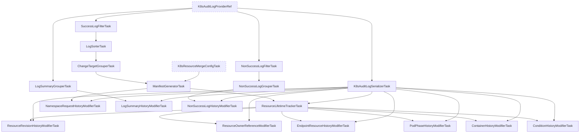

# Common Log K8s Audit v2 Inspection Tasks

This package contains inspection tasks for processing Kubernetes Audit Logs (v2).
It constructs a timeline of resource changes by analyzing audit logs, generating manifests, and tracking resource states.

## Task Graph

## Task Descriptions

### Common tasks (filter, grouper, serializers, etc.)

- **`K8sAuditLogProviderRef`**: Reference to the external task that provides the raw Kubernetes Audit Logs.
- **`K8sAuditLogSerializerTask`**: Registers logs into the history data before relating them with any events or revisions.
- **`SuccessLogFilterTask`**: Filters out non-success logs (e.g., error responses) to focus on successful operations that likely changed the cluster state.
- **`NonSuccessLogFilterTask`**: Filters out success logs to focus on failed operations (errors, forbidden, etc.).
- **`LogSorterTask`**: Sorts the successful logs by timestamp to ensure chronological processing.
- **`LogSummaryGrouperTask`**: Groups logs by their resource path to generate a summary of operations on each resource.
- **`NonSuccessLogGrouperTask`**: Groups non-success logs by their resource path.
- **`ChangeTargetGrouperTask`**: Groups logs by the *target* resource being modified. It handles complex cases like subresources (e.g., `status`, `scale`) and delete collection operations, ensuring they are associated with the correct parent resource.

### Manifest & Lifetime

- **`ManifestGeneratorTask`**: Reconstructs the resource manifest at each point in time by applying the changes from the audit logs. It uses `K8sResourceMergeConfigTask` to handle specific merge strategies for different Kubernetes resources.
- **`ResourceLifetimeTrackerTask`**: Tracks the lifetime of each resource (creation and deletion). It determines when a resource is created or deleted based on the audit logs and manifest changes.

### History Modifiers

These tasks generate the actual timeline events (revisions) for the resources.

- **`LogSummaryHistoryModifierTask`**: Generates a simple summary of log events (verb, URI) for the timeline. Summaries are handled in this task. The other tasks mustn't generate summaries.
- **`NonSuccessLogHistoryModifierTask`**: Generates events for failed operations, marking them as errors in the timeline.
- **`ResourceRevisionHistoryModifierTask`**: Generates the main resource revisions, showing the state of the resource body over time. It handles standard CRUD operations.
- **`ResourceOwnerReferenceModifierTask`**: Adds owner reference information to the timeline, allowing KHI to link resources (e.g., Pod to ReplicaSet).
- **`EndpointResourceHistoryModifierTask`**: Specifically tracks `Endpoint` and `EndpointSlice` resources, generating revisions that show the status of individual endpoints (ready, terminating, etc.).
- **`PodPhaseHistoryModifierTask`**: Tracks the phase of Pods (Pending, Running, Succeeded, Failed) and their node assignment.
- **`ContainerHistoryModifierTask`**: Tracks the status of containers within Pods (Waiting, Running, Terminated) and their state details (reason, exit code).
- **`ConditionHistoryModifierTask`**: Tracks the `status.conditions` of resources, generating revisions when conditions change (e.g., NodeReady, PodScheduled).
- **`NamespaceRequestHistoryModifierTask`**: Records events for requests against entire resources in namespace.
